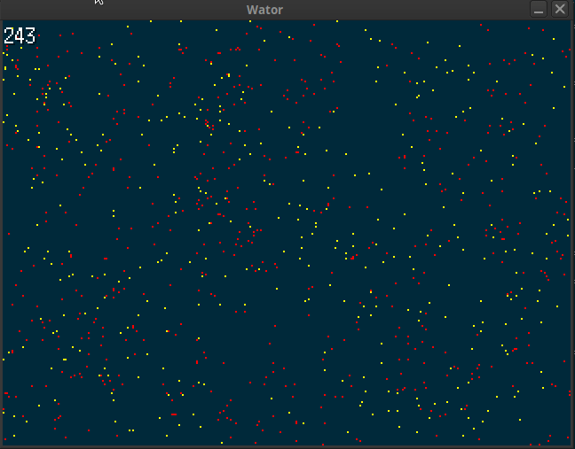

This is an implementation of the Wa-Tor (http://en.wikipedia.org/wiki/Wa-Tor\)
simulation.



I started this project as an exercise to learn the [Go Programming
Language](http://golang.org) so there will many newbie mistakes and
non-idiomatic patterns. This project is probably not much use to anyone else
except maybe to help people realize that there is an even less knowledgeable
gopher out there.

Install
-------

`go install lazyhacker.dev/wator`

Running
-------

To run wator just run the `wator` binary that is built or `go run
lazyhaker.dev/wator`.

```
Usage:
  -fbreed int
    	# of cycles for fish to reproduce. (default 400)
  -fish int
    	Initial # of fish. (default 1000)
  -height int
    	Height of the world (North-South). (default 240)
  -sbreed int
    	# of cycles for shark to reproduce. (default 150)
  -sharks int
    	Initial # of sharks. (default 500)
  -starve int
    	# of cycles shark can go with feeding before dying. (default 100)
  -width int
    	Width of the world (East - West). (default 320)
```

See it in your browser
----------------------

See this running in your browser at https://lazyhacker.dev/wator.
